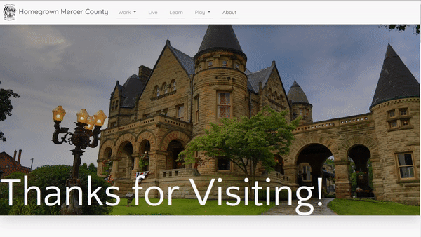

# The Penn-Northwest Homegrown Initiative's: Homegrown Mercer County

The Penn-Northwest Homegrown Initiative is a local nonprofit dedicated to improving the lives of people in Western Pennsylvanian community of Mercer County. This project is their website - the main functionality of which is helping people find work, homes, schools, activities, and community in the area.

**Link to project:** http://www.homegrownmc.com/

<!--  -->

## How It's Made:

**Tech used:** HTML, CSS, JavaScript, Bootstrap v5.2, Netlify Hosting

This site constitutes my first foray into the world of freelance web development - that is, the first project I've built for someone other than friends and family! The tech used is entirely vanilla HTML, CSS and JS (not counting the Bootstrap framework).

Primarily this is a static site, composed of 6 main HTML pages, each of which serving the purpose of elucidating some part of the local community to the user. The landing index.html was the greatest challenge of the entire site. As the user scrolls down on desktop they'll find distinct sections that work as calls to action to each of the other pages on the site. Each section contains a series of overlayed Divs - each of which with varying skew, transform, and styling rules that in sum total create a cool modern diagonal effect. The actual content of the divs are layed out using Flexbox (_love_ Flexbox).

<!-- _Check it out!_ -->

This is followed by a basic parallax-effect background image section and then the footer, wherein the user finds a form allowing the user to enter their email to join a mailing list, and a sitemap nav.

After this, the rest of the pages follow a similar flavor: A large heading with a header and tag line, followed by the relevant content.

The work page contains some of the more complicated JS scripts on the site. Most prominent to the user is the Salary/College/Job Openings animation. This effect is accomplished through an OOP Class oriented approach and the Intersection Observer API. When an Intersection is observed, a new class object is created. This class is fed the relevant data (Average salary, job openings - data provided by client) and a setInterval function is ran. Through what is essentially a stopwatch of varying numerical steps, the desired value is reached. As the iterator approaches the value, the number by which the iterator jumps lessens, thereby, in effect, slowing down the animation. As the value comes nearest the final value, the iterator starts incrementing by 1, until finally the value is reached and the interval is cleared - ending the animation.

Below this is a Contact form. This allows the user to put in information that is forwarded to the client, who uses it to get in contact with the user and thereby help them find work. This uses Netlify's form handling tech to scour the form and extract relevant data, constricting an Email to send to any specified parties.

The next pages are more or less your standard web content pages. The Live page has a fully-functional Cost of Living Calculator, using 3rd party tool and restyled on the page to essentially function as an impromptu api call. As well the Live page has a "Find your Neighborhood Quiz" - essentially a game utilizing HTML, CSS, and JS to make a fun interactive experience for the user all while helping them find which neighborhood in Mercer County they may best enjoy!

..._whew!_

Looking over everything, this has been quite the project!

## Optimizations

A primary optimization on this site was the work-script.js class Iterator.
Initially, this utilized a setTimeout method of obtaining its result. Essentially, what would happen as that for each tick of the loop, a new instance of setTimeout would be generated. Functionally, this worked at first, but the more it was tested, the more it was found to be something of a functional nightmare. Occasionally, depending on the browser (looking at you, Safari), the Iterator would mess with the Intersection Observer API and make the page unscrollable on mobile. As well, it was just generally slower.

So, instead of that, it was refactored to use the setInterval method, and the logic of the loop was significantly pruned - replaced with conditionals that changed the interval value based on how close to the final value it is. This completely cleared up the scrolling problems on mobile/safari browsers, and made the animation much smoother. The client really preferred this change - as well as all test users during the testing phase of development.

## Lessons Learned:

**_Wow... weird to finally be at the end of this project_**

If I'm being honest with myself, it's almost bittersweet to reach the end of this project. To pull this project off within the deadline agreed upon with the client, I had to completely immerse myself in the world of web development - in essence, learn graphic designing, layout and design patterns, Bootstrap, OOP as it applies to JS, API calls, Intersection Observer API, client relations, how to write a project proposal and contract, how to refactor and test, how to... the list goes on. If I were to compare this site to what I could build before this project, the difference would be night and day.
I learned that what this field - the field of programming - really is is a never-ending journey of always learning. Of reading, of always writing code, of trying and failing, and of learning to be patient with myself. When the project started, I wasn't sure if I would be able to pull it off. Speaking with the client scared the hell out of me, communicating technical details seemed impossible, and imposter syndrome was at an all time high. Now, at the end of the project, I won't pretend that these things aren't still a factor to a degree, but I've learned to recontextualize them - to try despite my preoccupations, to accept that I'm not going to get everything on the first try - to learn from my mistakes while the pressure's on.

This project has been a fantastic experience, and I'm forever grateful to Penn-Northwest for being so great in fostering its development. They're the best, as well as the programming community as such. I love tech, and and this project has shown beyond a shadow of a doubt that I've making the right decision by dedicating my life to it.

## Examples:
